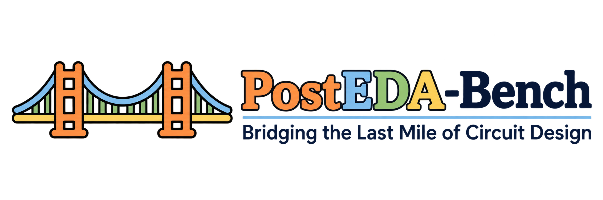
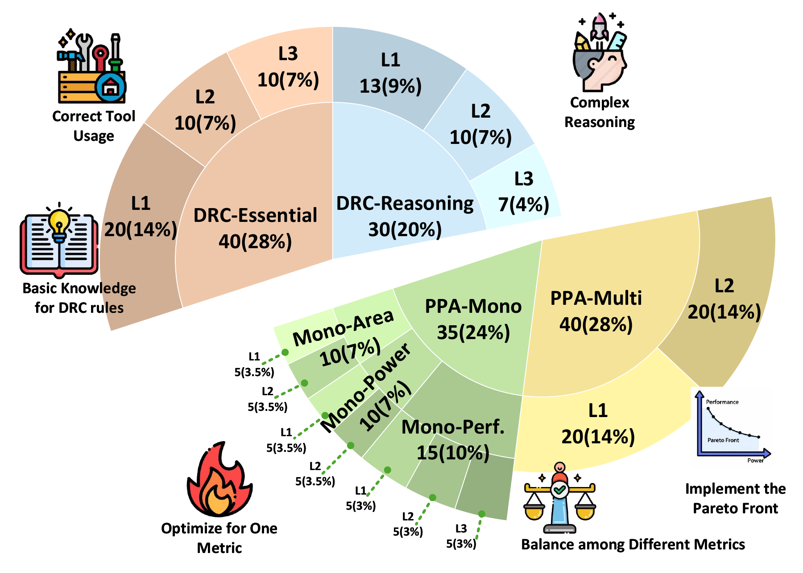
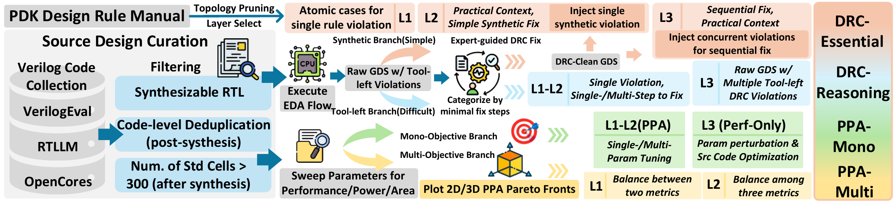
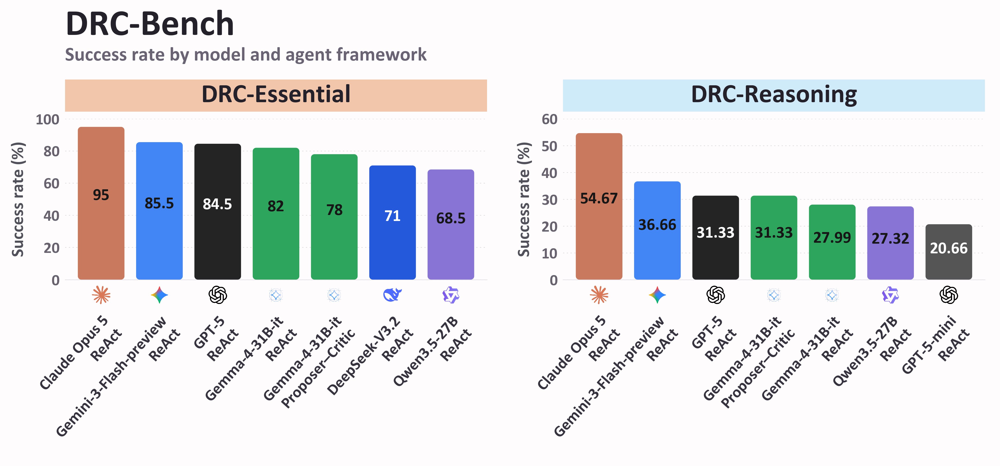
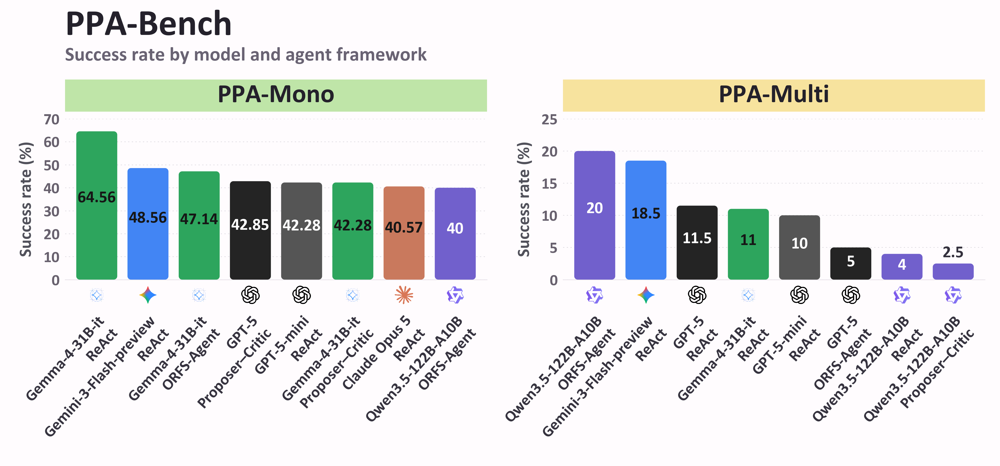
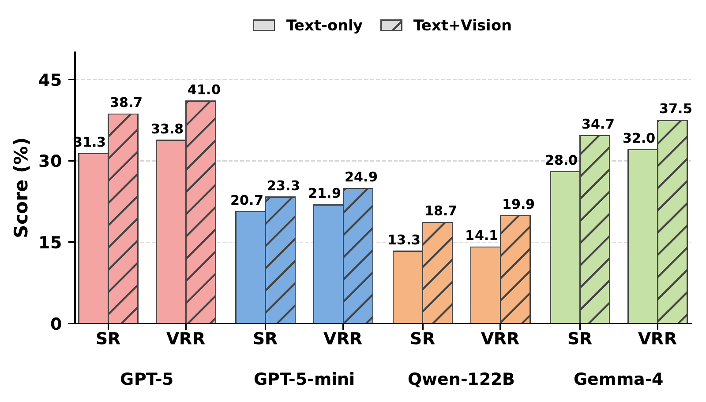
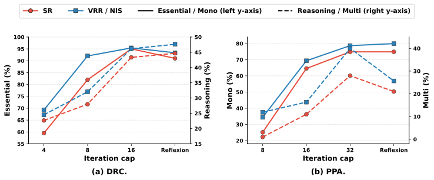

<p align="center">
  
</p>

<p align="center">
  
</p>

<p align="center">
  <strong>145 challenges. Two unforgiving arenas. One mission: close the design.</strong>
</p>

<p align="center">
  <a href="https://arxiv.org/abs/2605.06936"></a>
  <a href="benchmark"></a>
  <a href="benchmark/drc_bench"></a>
  <a href="benchmark/ppa_bench"></a>
  <a href="LICENSE"></a>
</p>

<p align="center">
  <a href="https://arxiv.org/abs/2605.06936"><strong>Read the Paper</strong></a> ·
  <a href="#the-challenge"><strong>The Challenge</strong></a> ·
  <a href="#the-results-are-a-wake-up-call"><strong>Results</strong></a> ·
  <a href="benchmark"><strong>Explore the Benchmark</strong></a> ·
  <a href="DEPLOYMENT.md"><strong>Run It Yourself</strong></a> ·
  <a href="#citation"><strong>Cite</strong></a>
</p>

---

## What is PostEDA-Bench?

**PostEDA-Bench** evaluates AI agents on two tasks: fixing DRC violations in an existing GDS layout (**DRC-Bench**) and optimizing existing Verilog code and EDA configurations for power, performance, and area (**PPA-Bench**). Both tasks start from existing designs rather than a design specification.

📄 **[Bridging the Last Mile of Circuit Design: PostEDA-Bench, a Hierarchical Benchmark for PPA Convergence and DRC Fixing](https://arxiv.org/abs/2605.06936)**

Pengju Liu, Nuo Xu, Jinwei Tang, Yu Cao, and Caiwen Ding · University of Minnesota

## The challenge

**Two arenas. Plenty of ways to get humbled.**

<p align="center">
  <a href="assets/figures/benchmark_separated.pdf"></a>
</p>

<p align="center">
  <em>145 tasks across four task families in a multi-level hierarchy.</em><br>
  Benchmark task overview · <a href="assets/figures/benchmark_separated.pdf">Open full-resolution figure</a>
</p>

| Arena | The mission | Tasks and evaluation levels |
| --- | --- | --- |
| 🛠️ **DRC-Bench** | Inspect and repair DRC violations in GDS layouts with KLayout and the ASAP7 rule deck. | **70 tasks**<br>**DRC-Essential (40):** L1 tests basic rule understanding; L2 tests identifying relevant geometry in layout context; L3 tests sequential repair of interacting violations.<br>**DRC-Reasoning (30):** L1 tests geometric reasoning for a repair requiring one edit; L2 requires multiple edits for one violation; L3 tests debugging multiple violations in a full layout. |
| ⚡ **PPA-Bench** | Tune flow configurations, timing constraints (.sdc), or RTL, then run OpenROAD to chase demanding optimization targets. | **75 tasks**<br>**PPA-Mono (35):** L1 tests correcting one perturbed parameter; L2 tests coordinating several parameters; L3 (performance only) tests RTL restructuring or timing-constraint changes beyond parameter tuning.<br>**PPA-Multi (40):** L1 tests trade-offs between two PPA metrics; L2 tests balancing all three while meeting the target constraints. |

*Tools: We equip agents with tools to inspect layouts and reports, edit geometry, Verilog code, and EDA configurations, and rerun DRC checks or OpenROAD flows. Agents have the flexibility to choose their tools, plan changes, and iterate on feedback much like a human engineer.*

**A taste of the pressure:** [one PPA task](benchmark/ppa_bench/ppa_multi/L1/q1/prompt.txt) asks an agent to cut effective period from **319.69 ps to at most 241 ps** while keeping power at or below **0.002 W**. That is roughly a **25% period reduction**, with a power ceiling to defend. This is the task target; the agent still has to earn the result.

## How PostEDA-Bench is built

PostEDA-Bench is constructed from curated RTL designs, design rules, and EDA tool runs. **DRC-Bench** combines deliberately introduced violations with residual DRC errors from completed flows. **PPA-Bench** uses configuration sweeps to establish reference solutions and Pareto targets, creating tasks that require parameter tuning, RTL changes, or trade-offs among PPA metrics.

<p align="center">
  <a href="assets/figures/benchmark-construction.pdf"></a>
</p>

<p align="center">
  <em>Construction of DRC repair and PPA optimization tasks from design rules, RTL designs, and EDA outputs.</em><br>
  Figure 2 from the paper · <a href="assets/figures/benchmark-construction.pdf">Open full-resolution figure</a>
</p>

## The results are a wake-up call

**The last mile fights back.** Agents perform better on synthetic DRC repairs and single-objective PPA tuning, but struggle with practical layout violations and competing PPA targets. In the paper's main comparison, the strongest DRC-Reasoning result reaches **54.67%** success, and the strongest PPA-Multi result reaches **20.00%**. Practical DRC repair requires geometric reasoning and coordinated edits, while PPA optimization must improve target metrics without violating other constraints. There is serious room for the next breakthrough.

<p align="center">
  <a href="assets/figures/drc-success-rates-top7.pdf"></a>
</p>

<p align="center">
  <a href="assets/figures/ppa-success-rates-top8.pdf"></a>
</p>

*Source: [arXiv v4, Table 3](https://arxiv.org/html/2605.06936v4#S3.T3). Each panel shows the top seven DRC or top eight PPA configurations by mean success rate over five runs per task. See [Sections 4.2.1–4.2.2 of the paper](https://arxiv.org/html/2605.06936v4#S4.SS2.SSS1) for detailed per-level breakdowns of DRC-Bench and PPA-Bench.*

### Finding 1: Give the agent eyes

**The geometry is part of the puzzle.** In the DRC-Reasoning vision ablation, adding layout images raises observed success rates for all four evaluated backbones. Pooled gains are positive, though individual gains are not uniformly statistically significant.

<p align="center">
  <a href="assets/figures/drc-vision-reasoning.pdf"></a>
</p>

<p align="center">
  <em>SR: success rate. VRR: violation reduction rate. Higher is better; values are percentages.</em><br>
  <a href="https://arxiv.org/html/2605.06936v4#S4.F5">Figure 5(b), arXiv v4</a> · <a href="assets/figures/drc-vision-reasoning.pdf">Open full-resolution figure</a>
</p>

### Finding 2: Give harder tasks room to iterate

**The iteration budget matters differently across tasks.** With Gemma-4-31B-it under ReAct, DRC-Essential and PPA-Mono show diminishing returns, while DRC-Reasoning and PPA-Multi keep improving at the largest tested caps. Reflexion also improves on ReAct at the same per-attempt cap: DRC-Reasoning success rises from **27.99% to 44.66%**, and PPA-Multi from **11.00% to 21.00%**. It uses two fresh attempts, carrying only a verbal reflection between them, at twice the total iteration budget.

<p align="center">
  <a href="assets/figures/iteration-budget.svg"></a>
</p>

<p align="center">
  <em>Effect of iteration cap and Reflexion on Gemma-4-31B-it. Solid and dashed lines use the left and right y-axes, respectively.</em><br>
  <a href="https://arxiv.org/html/2605.06936v4#S4.F6">Figure 6, arXiv v4</a>
</p>

### Finding 3: Match the thinking strategy to the task

**More deliberation does not guarantee better results.** For Gemma-4-31B-it under ReAct, enabling thinking improves DRC-Essential, DRC-Reasoning, and PPA-Mono success, but lowers PPA-Multi from **18.50% to 11.00%**. Tree-of-Thought modestly improves DRC success yet reduces PPA-Mono to **31.42%** and PPA-Multi to **0.00%**. These results suggest that effective exploration and tool feedback matter alongside reasoning under a fixed iteration cap.

<table>
  <thead>
    <tr>
      <th rowspan="2">Thinking</th>
      <th colspan="2">DRC-Essential</th>
      <th colspan="2">DRC-Reasoning</th>
      <th colspan="2">PPA-Mono</th>
      <th colspan="2">PPA-Multi</th>
    </tr>
    <tr>
      <th>SR (%)</th><th>VRR (%)</th>
      <th>SR (%)</th><th>VRR (%)</th>
      <th>SR (%)</th><th>NIS (%)</th>
      <th>SR (%)</th><th>NIS (%)</th>
    </tr>
  </thead>
  <tbody>
    <tr>
      <td>On</td>
      <td>82.00</td><td><strong>92.02</strong></td>
      <td>27.99</td><td><strong>32.05</strong></td>
      <td><strong>64.56</strong></td><td><strong>69.34</strong></td>
      <td>11.00</td><td>16.34</td>
    </tr>
    <tr>
      <td>Off</td>
      <td>51.00</td><td>63.75</td>
      <td>8.66</td><td>8.66</td>
      <td>54.28</td><td>65.20</td>
      <td><strong>18.50</strong></td><td><strong>38.40</strong></td>
    </tr>
    <tr>
      <td>ToT</td>
      <td><strong>85.50</strong></td><td>90.35</td>
      <td><strong>29.99</strong></td><td>31.55</td>
      <td>31.42</td><td>40.53</td>
      <td>0.00</td><td>1.35</td>
    </tr>
  </tbody>
</table>

*Source: [Table 6, arXiv v4](https://arxiv.org/html/2605.06936v4#S4.T6). Thinking-mode ablation for Gemma-4-31B-it under ReAct. SR: success rate; VRR: violation reduction rate; NIS: normalized improvement score. ToT: Tree-of-Thought. Higher is better; bold marks the largest value in each metric column.*

## Bring your strongest agent

We help you [set up and configure the infrastructure](DEPLOYMENT.md) and equip your agent with flexible tools, so you can focus on making it better at fixing DRC violations and optimizing power, performance, and area.

## Citation

If PostEDA-Bench powers your research, please cite the [paper](https://arxiv.org/abs/2605.06936):

```bibtex
@misc{liu2026posteda,
  title = {Bridging the Last Mile of Circuit Design: {PostEDA-Bench}, a Hierarchical Benchmark for {PPA} Convergence and {DRC} Fixing},
  author = {Pengju Liu and Nuo Xu and Jinwei Tang and Yu Cao and Caiwen Ding},
  year = {2026},
  eprint = {2605.06936},
  archivePrefix = {arXiv},
  primaryClass = {cs.AR},
  url = {https://arxiv.org/abs/2605.06936}
}
```

---

<p align="center">
  <strong>Build the agent. Take the challenge. Show what it can close.</strong><br>
  Star the repository, explore the tasks, and bring your next chip-design idea to PostEDA-Bench.
</p>

<p align="center">
  Released under <a href="LICENSE">CC BY 4.0</a>.
</p>
