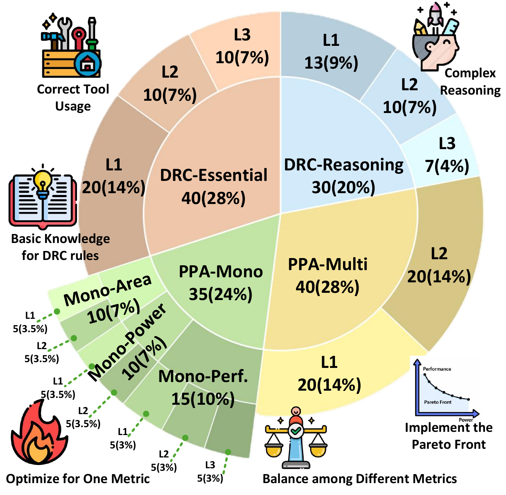

<p align="center">
  
</p>

<h1 align="center">Can your AI agent close PPA targets and conquer DRC errors?</h1>

<p align="center">
  <strong>145 challenges. Two unforgiving arenas. One mission: close the design.</strong>
</p>

<p align="center">
  <a href="https://arxiv.org/abs/2605.06936"></a>
  <a href="benchmark"></a>
  <a href="benchmark/drc_bench"></a>
  <a href="benchmark/ppa_bench"></a>
  <a href="LICENSE"></a>
</p>

<p align="center">
  <a href="https://arxiv.org/abs/2605.06936"><strong>Read the Paper</strong></a> ·
  <a href="#the-challenge"><strong>The Challenge</strong></a> ·
  <a href="#the-results-are-a-wake-up-call"><strong>Results</strong></a> ·
  <a href="benchmark"><strong>Explore the Benchmark</strong></a> ·
  <a href="DEPLOYMENT.md"><strong>Run It Yourself</strong></a> ·
  <a href="#citation"><strong>Cite</strong></a>
</p>

---

**The tools have run. The reports are in. The design still needs a hero.**

A layout violates manufacturing rules. A timing target refuses to budge. A power constraint leaves almost no room to maneuver. Welcome to **post-EDA design closure**, where an agent must inspect the evidence, choose an intervention, change the design, and face the tools again.

**PostEDA-Bench puts that engineering pressure at the center of agent evaluation.** It brings together real GDS layouts, RTL, tool reports, and executable evaluation flows to test whether LLM agents can repair design-rule violations and optimize power, performance, and area.

📄 **[Bridging the Last Mile of Circuit Design: PostEDA-Bench, a Hierarchical Benchmark for PPA Convergence and DRC Fixing](https://arxiv.org/abs/2605.06936)**

Pengju Liu, Nuo Xu, Jinwei Tang, Yu Cao, and Caiwen Ding · University of Minnesota

## The challenge

**Two arenas. Plenty of ways to get humbled.**

<p align="center">
  <a href="assets/figures/benchmark-overview.pdf"></a>
</p>

<p align="center">
  <em>145 tasks, four task families, and escalating demands on rule knowledge, geometric reasoning, and PPA trade-offs.</em><br>
  Figure 1 from the paper · <a href="assets/figures/benchmark-overview.pdf">Open full-resolution figure</a>
</p>

| Arena | The mission | The scale |
| --- | --- | --- |
| 🛠️ **DRC-Bench** | Inspect and repair design-rule violations in GDS layouts with KLayout and the ASAP7 rule deck. | **70 tasks**: 40 essential + 30 reasoning; L1–L3. |
| ⚡ **PPA-Bench** | Tune flow configurations, timing constraints, or RTL, then run OpenROAD to chase demanding optimization targets. | **75 tasks**: 35 single-objective + 40 multi-objective. |

DRC moves from essential rule-violation patterns to composite errors that demand multiple reasoning steps. PPA turns up the pressure across area, power, and performance, then demands that agents balance competing objectives in the multi-objective track.

**A taste of the pressure:** [one PPA task](benchmark/ppa_bench/ppa_multi/L1/q1/prompt.txt) asks an agent to cut effective period from **319.69 ps to at most 241 ps** while keeping power at or below **0.002 W**. That is roughly a **25% period reduction**, with a power ceiling to defend. This is the task target; the agent still has to earn the result.

## How the gauntlet is built

**From source RTL to a full-spectrum engineering stress test.** The paper's construction pipeline turns curated designs, controlled violations, and PPA parameter sweeps into tasks that probe progressively harder design-closure skills.

<p align="center">
  <a href="assets/figures/benchmark-construction.pdf"></a>
</p>

<p align="center">
  <em>Rule-level repairs, residual post-flow violations, single-objective tuning, and multi-objective trade-offs.</em><br>
  Figure 2 from the paper · <a href="assets/figures/benchmark-construction.pdf">Open full-resolution figure</a>
</p>

## The results are a wake-up call

**The last mile fights back.** In the paper's main comparison, the strongest DRC-Reasoning result reaches **36.66%** success, and the strongest PPA-Multi result reaches **20.00%**. There is serious room for the next breakthrough.

| Task family | Best mean success rate | Model | Agent framework |
| --- | ---: | --- | --- |
| DRC-Essential | **85.50%** | Gemini-3-Flash-preview | ReAct |
| DRC-Reasoning | **36.66%** | Gemini-3-Flash-preview | ReAct |
| PPA-Mono | **64.56%** | Gemma-4-31B-it | ReAct |
| PPA-Multi | **20.00%** | Qwen3.5-122B-A10B | ORFS-Agent |

*Source: [arXiv v3, Table 3](https://arxiv.org/html/2605.06936v3). Each row selects the highest mean SR in the main comparison, averaged over five runs per task. Vision and iteration-budget ablations are separate experiments.*

### Give the agent eyes

**The geometry is part of the puzzle.** In the DRC-Reasoning vision ablation, adding layout images raises observed success rates for all four evaluated backbones.

<p align="center">
  <a href="assets/figures/drc-vision-reasoning.pdf"></a>
</p>

<p align="center">
  <em>SR: success rate. VRR: violation reduction rate. Higher is better; values are percentages.</em><br>
  <a href="https://arxiv.org/html/2605.06936v3">Figure 5(b), arXiv v3</a> · <a href="assets/figures/drc-vision-reasoning.pdf">Open full-resolution figure</a>
</p>

## Why this benchmark hits hard

- **The artifacts are the arena.** Agents work with layouts, source code, configurations, and tool reports. Every intervention has consequences in the design flow.
- **The loop is the challenge.** Inspect, reason, edit, run, and reassess. Each new report can force a new plan.
- **The tools deliver the verdict.** Evaluation measures success rate, DRC error reduction, and PPA violation reduction, with logs and token-cost records to inspect what happened.
- **Correctness has teeth.** For designs with supported testbenches, the PPA harness includes an RTL functional-equivalence sanity check; detected functional divergence is marked `FAIL_FUNCTIONAL`.
- **The baselines are ready to battle.** Compare ReAct, Reflexion, Tree-of-Thoughts, proposer–critic, and an ORFS agent that pairs LLM-driven search-space discovery with Gaussian-process optimization.

## Bring your strongest agent

Explore the [DRC baselines](agents/drc), [PPA baselines](agents/ppa), and the [ORFS agent guide](agents/ppa/orfs_agent/README.md). Study how different reasoning strategies handle tool use, iteration budgets, and the moment a promising edit meets an unforgiving report.

The repository includes benchmark inputs, reference artifacts, agent implementations, evaluation harnesses, and pinned Python dependencies. The full path from environment setup to evaluation lives in the **[Deployment & Reproduction Guide](DEPLOYMENT.md)**.

| Start here | What you will find |
| --- | --- |
| [Deployment & reproduction](DEPLOYMENT.md) | Toolchain setup, environment variables, evaluation commands, outputs, and a smoke test. |
| [DRC benchmark](benchmark/drc_bench) | Layout-repair tasks across essential and reasoning splits. |
| [PPA benchmark](benchmark/ppa_bench) | Single-objective and multi-objective optimization tasks. |
| [Agent suite](agents) | Baseline reasoning strategies and EDA tool interfaces. |
| [Evaluation harnesses](eval) | DRC/PPA scoring and the RTL sanity-check machinery. |
| [Dataset metadata](croissant.json) | Machine-readable dataset description in Croissant format. |

## Citation

If PostEDA-Bench powers your research, please cite the [paper](https://arxiv.org/abs/2605.06936):

```bibtex
@misc{liu2026posteda,
  title = {Bridging the Last Mile of Circuit Design: {PostEDA-Bench}, a Hierarchical Benchmark for {PPA} Convergence and {DRC} Fixing},
  author = {Pengju Liu and Nuo Xu and Jinwei Tang and Yu Cao and Caiwen Ding},
  year = {2026},
  eprint = {2605.06936},
  archivePrefix = {arXiv},
  primaryClass = {cs.AR},
  url = {https://arxiv.org/abs/2605.06936}
}
```

---

<p align="center">
  <strong>Build the agent. Take the challenge. Show what it can close.</strong><br>
  Star the repository, explore the tasks, and bring your next chip-design idea to PostEDA-Bench.
</p>

<p align="center">
  Released under <a href="LICENSE">CC BY 4.0</a>.
</p>
